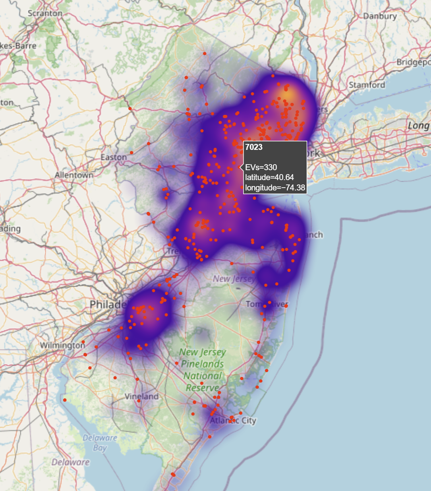
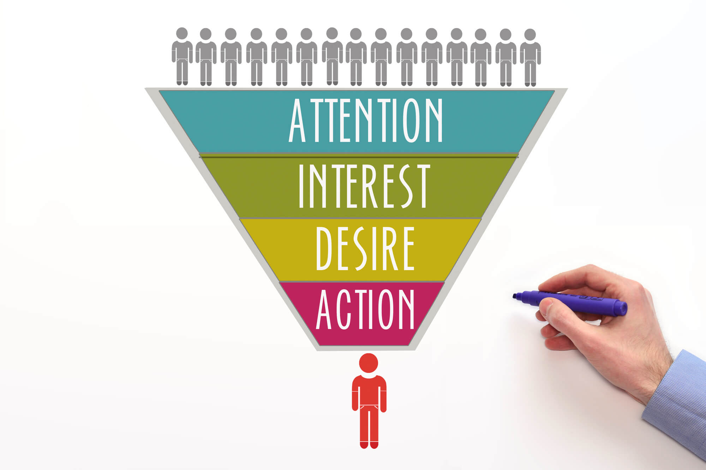
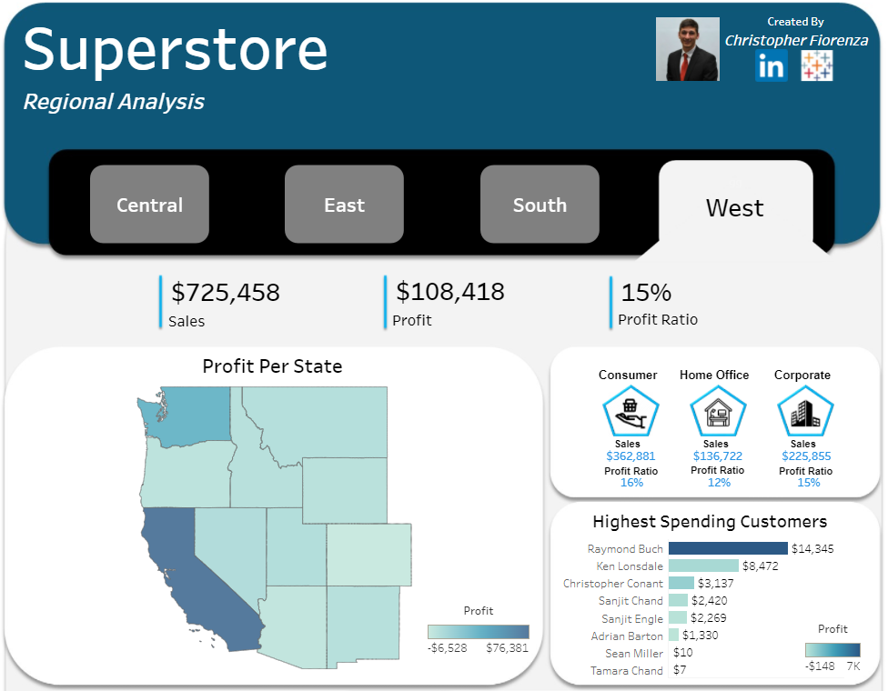
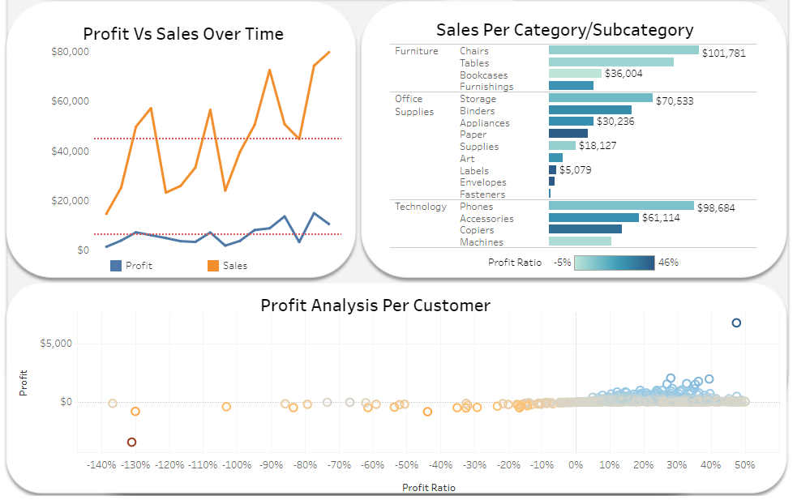

# **cfiorenza_portfolio**

***Hello and welcome to my data analyst portfolio! My name is Christopher Fiorenza and I am excited to show you what I have recently been working on. Below you will find a list of projects and their descriptions. Clicking the titles will link to the location of the project where you can dive deeper into the assignment. Feel free to check out my [LinkedIn Profile](https://www.linkedin.com/in/christopherfiorenza/) and [Tableau Public Profile](https://public.tableau.com/app/profile/christopher.fiorenza#!/?newProfile=&activeTab=0) to learn more about me and some of the other work that I have done.***

---------------------------------------------------------------------------------------------------------------------------------------------------------------------------------

## ***[Python Charging Station Analysis](https://github.com/fiorenza1116/Charging_Station_Analysis)***

***Description***

Using registered vehicle data, zip codes, and charging station location data, I created a python script that displays all electric vehicle charging stations in NJ relative to the registered EV density per zip code. This project was created in Jupyter Notebook.

***Objective***

The goal of this project was to create a visualization in Python to display the electric vehicle population density in New Jersey, and compare it to the electric vehicle charging station locations in the state. 

---------------------------------------------------------------------------------------------------------------------------------------------------------------------------------
## ***[Warby Parker SQL Funnels](https://github.com/fiorenza1116/Warby_Parker_SQL_Funnels)***

***Description***

Warby Parker is a transformative lifestyle brand with a lofty objective: to offer designer eyewear at a revolutionary price while leading the way for socially conscious businesses. Founded in 2010 and named after two characters in an early Jack Kerouac journal, Warby Parker believes in creative thinking, smart design, and doing good in the world — for every pair of eyeglasses and sunglasses sold, a pair is distributed to someone in need.

***Objective***

In this project, I will use fictional raw data provided by the data scientists at Warby Parker to analyze Warby Parker marketing funnels by calculating conversion rates and other means of data manipulation.

---------------------------------------------------------------------------------------------------------------------------------------------------------------------------------
## ***[Superstore - Regional Analysis Tableau Dashboard](https://public.tableau.com/app/profile/christopher.fiorenza/viz/Superstore-RegionalAnalysis/Dashboard1)***

***Description***

The Superstore is a fictional retail store that sells several products throughout the United States. Tableau provides this data source to every user for free. It is incredibly detailed and allows the users to create all kinds of dashboards. With the data set provided, I created and designed a dashboard that allows management of the Superstore to access all of their KPIs in one view. The unique functionalities of Tableau allow the users to drill down further into their analysis, which in lead can enable them into making some very strategic decisions for the company going further.

***Objective***

This dashboard was created to break down profit analysis within the Superstore franchise. The capabilities behind this dashboard are endless:
- Breakdown profit/sales per region, state, industry, category, or subcategory
- Drill down to the highest spending customers in the selected focus area, and compare them to the others
- Follow trends in sales
- Dive into where profits are hurting the most. 
- Imagine integrating something like this into your organization

---------------------------------------------------------------------------------------------------------------------------------------------------------------------------------
## ***[Codeflix: Calculating Churn in SQL](https://github.com/fiorenza1116/Codeflix_Calculating_Churn)***

***Description***

Four months into launching Codeflix, management asks you to look into subscription churn rates. It’s early on in the business and people are excited to know how the company is doing. The marketing department is particularly interested in how the churn compares between two segments of users. They provide you with a dataset containing subscription data for users who were acquired through two distinct channels.

***Objective***

Use the provided subscription data and write a SQL query to compare churn rates accross segments at Codeflix. Discover ways to optimize your query to be used in scale. Follow each step of the instructions provided to reach the end result.

---------------------------------------------------------------------------------------------------------------------------------------------------------------------------------
## ***[CoolTShirts Marketing Attribution with SQL and Tableau](https://public.tableau.com/app/profile/christopher.fiorenza/viz/CoolTShirtsMarketingAttribution/CoolTShirtsMarketingAttribution?publish=yes)***

***Description***

CoolTShirts sells shirts of all kinds, as long as they are T-shaped and cool. Recently, CTS started a few marketing campaigns to increase website visits and purchases. Using touch attribution, they’d like to map their customers’ journey: from initial visit to purchase. They can use that information to optimize their marketing campaigns.

***Objective***

With the raw data provided, help CTS learn more about their campaigns. Write SQL queries to provide the answers to each question asked and visualize the solutions in a dashboard accordingly.

***Instructions For Viewers***

Review the [page_visits.csv](https://github.com/fiorenza1116/CoolTShirts_Marketing_Attribution/blob/main/page_visits.csv) data set below to get an understanding of the data behind the project. Then continue to the [CoolTShirts: Marketing Attribution Dashboard](https://public.tableau.com/app/profile/christopher.fiorenza/viz/CoolTShirtsMarketingAttribution/CoolTShirtsMarketingAttribution?publish=yes) to review the visual solutions that were powered by the SQL queries [(CoolTShirt_Marketing_Attribution.sql)](https://github.com/fiorenza1116/CoolTShirts_Marketing_Attribution/blob/main/CoolTShirts_Marketing_Attribution.sql ) that I created.
